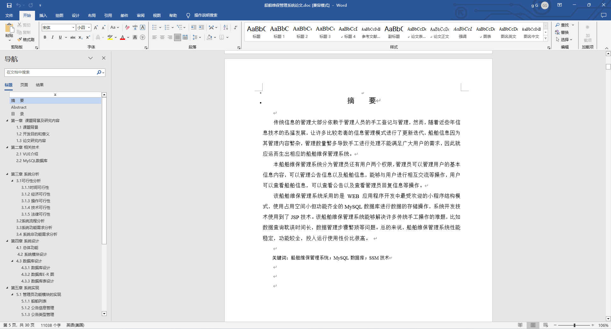
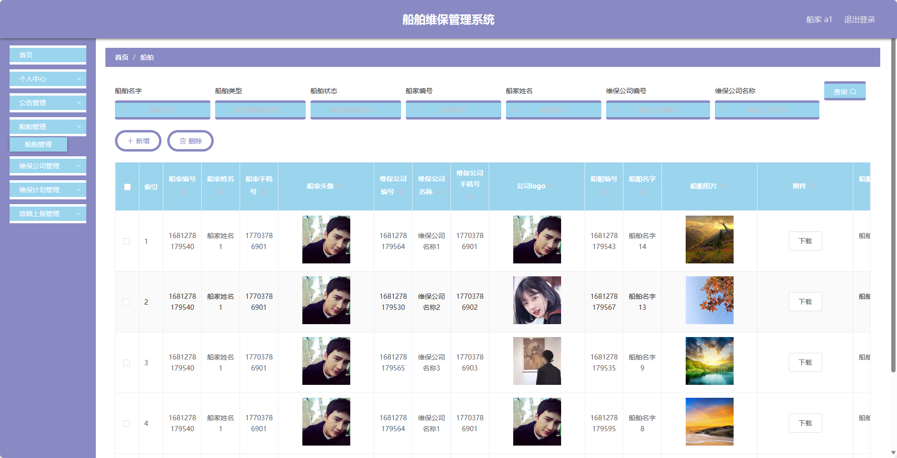
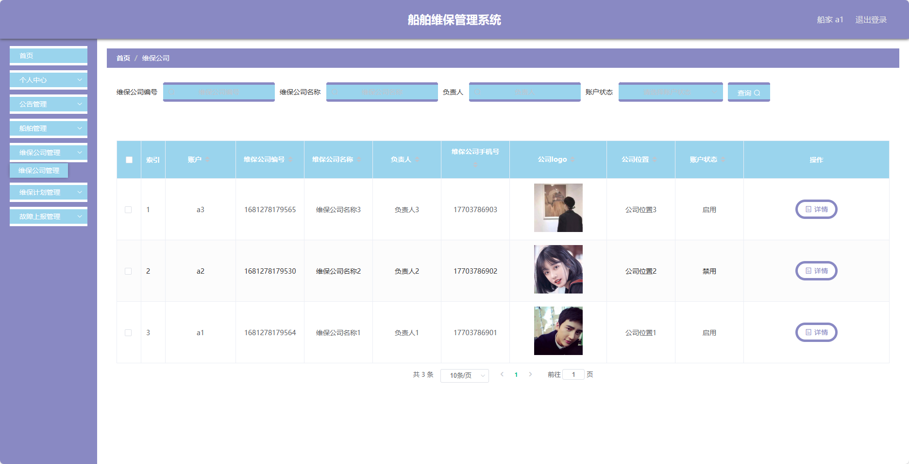
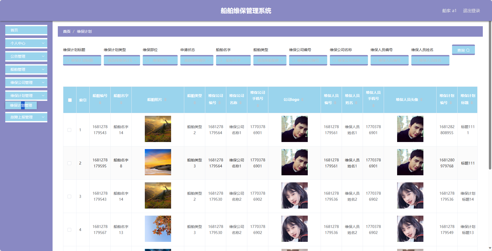
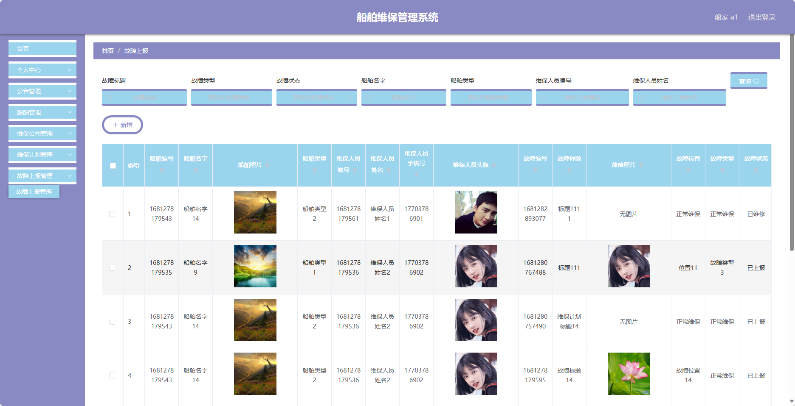
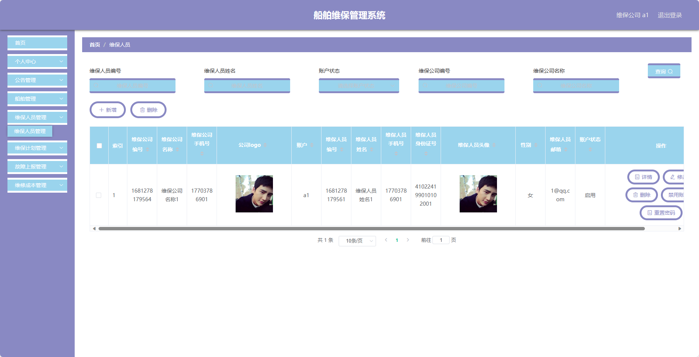
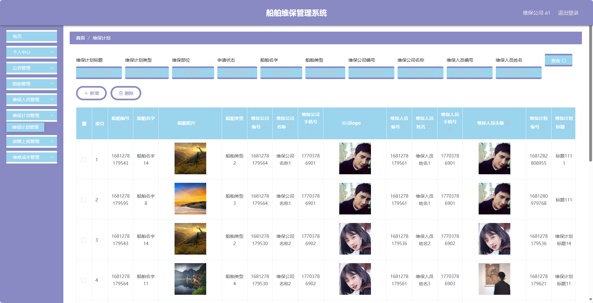
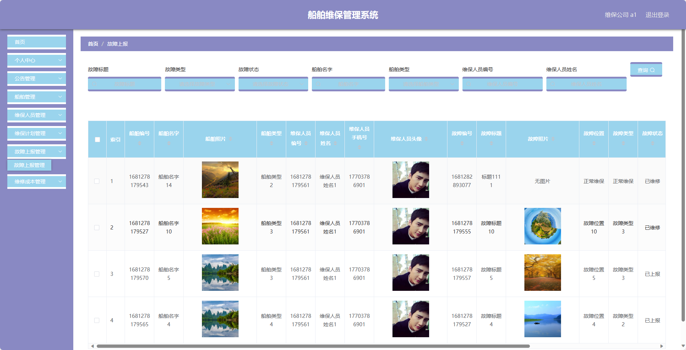
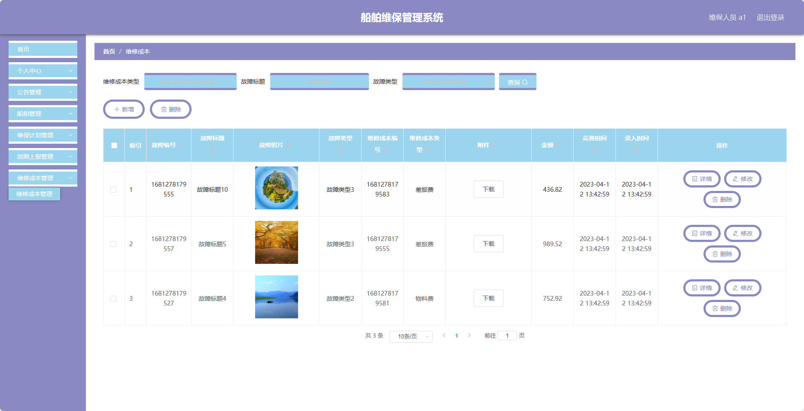

## 基于SpringBoot的船舶维保管理系统(程序+报告)

###  获取sql数据库文件: 从戎源码网 (https://armycodes.com/) QQ: 386869957 QQ群: 377586148
###  所有系统地址: (https://github.com/YuLin-Coder/AllProjectCatalog) 
###  所有项目以及源代码本人均调试运行无问题 可支持远程安装部署调试、定制修改、代码讲解

## 项目介绍
基于SpringBoot的船舶维保管理系统，系统包含四种角色：管理员、船家、维保人员、维保公司,系统分为前台和后台两大模块，主要功能如下

### 【管理员】:
- 个人中心：管理个人信息。
- 管理员管理：管理系统管理员的信息。
- 基础数据管理：管理系统的基础数据。
- 公告管理：发布和管理系统公告。
- 船家管理：管理船家的信息。
- 船舶管理：管理所有船舶的信息。
- 维保公司管理：管理维保公司的信息。
- 维保人员管理：管理维保人员的信息。
- 维保计划管理：管理船舶的维保计划。
- 故障上报管理：接收和处理船舶的故障上报。
- 维修成本管理：记录和统计维修过程中的成本。

### 【船家】:
- 个人中心：管理个人信息。
- 公告管理：查看和发布系统公告。
- 船舶管理：管理自己的船舶信息。
- 维保公司管理：选择和管理维保公司。
- 维保计划管理：制定和管理船舶的维保计划。
- 故障上报管理：上报船舶的故障情况。

### 维保公司：
- 个人中心：管理个人信息。
- 公告管理：查看和发布系统公告。
- 船舶管理：管理负责的船舶信息。
- 维保人员管理：管理维保人员的信息。
- 维保计划管理：制定和管理船舶的维保计划。
- 故障上报管理：接收和处理船舶的故障上报。
- 维修成本管理：记录和统计维修过程中的成本。

### 维保人员：
- 个人中心：管理个人信息。
- 公告管理：查看系统公告。
- 船舶管理：管理负责的船舶信息。
- 维保计划管理：查看和执行船舶的维保计划。
- 故障上报管理：上报船舶的故障情况。
- 维修成本管理：记录和统计维修过程中的成本。

## 项目技术
- 编程语言：Java
- 数据库：MySQL
- 项目管理工具：Maven
- 前端技术：HTML、CSS、JavaScript、Jquery、Vue
- 后端技术：Spring、SpringMVC、MyBatis

## 运行环境
- JDK版本：JDK1.8及以上
- 开发工具：IDEA、Ecplise、Myecplise都可以
- 数据库: MySQL5.7及以上
- Maven：maven3.0及以上
- Node：14.14.0及以上

## 运行截图

